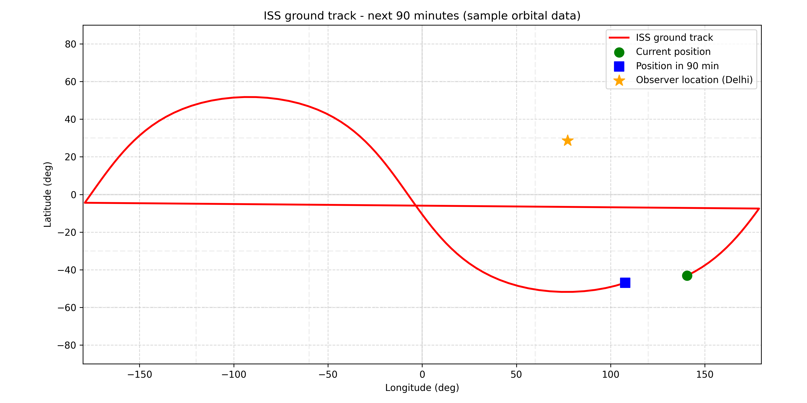
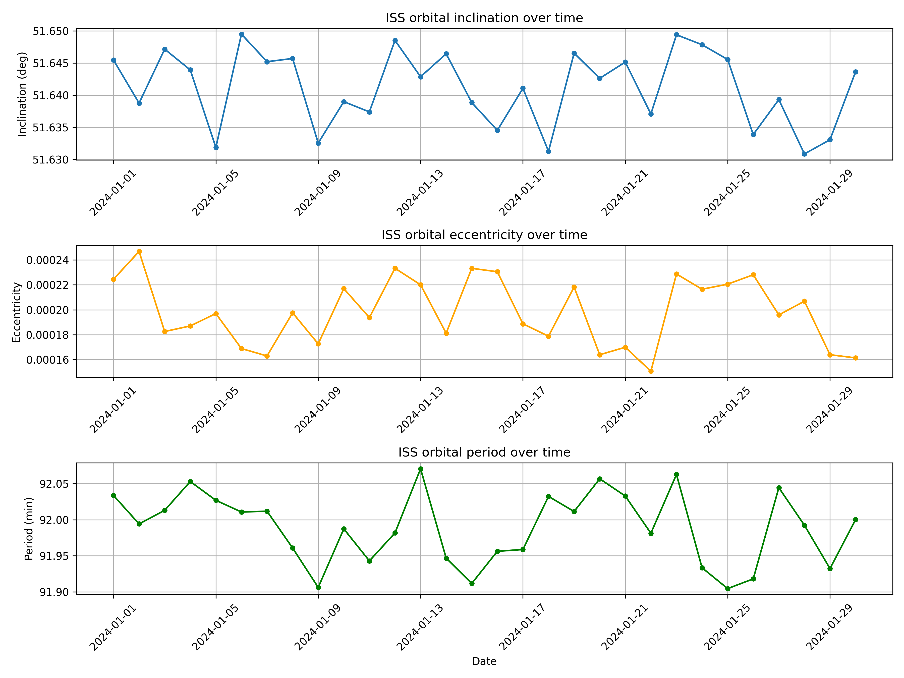

# Python in Astronomy: Tracking the International Space Station (ISS)

A Python toolkit for tracking the International Space Station (ISS) using live orbital data, built with Skyfield, Astropy-adjacent geospatial tooling, and Matplotlib. Built as part of the ISA (India Space Academy) Summer School 2025 — Astronomy & Astrophysics program.

This project demonstrates a practical, end-to-end workflow: fetching real-time orbital elements, predicting visible passes over any location on Earth, visualizing the ISS's ground track, and analyzing how its orbit drifts over time.

---

## Table of Contents

- [Background](#background)
- [Objectives](#objectives)
- [Methodology](#methodology)
- [Project Structure](#project-structure)
- [Module Overview](#module-overview)
- [Results](#results)
- [Running the Code](#running-the-code)
- [Limitations & Future Work](#limitations--future-work)
- [References](#references)
- [Author](#author)
- [License](#license)

---

## Background

The International Space Station (ISS) is a continuously crewed satellite in low Earth orbit, completing roughly 16 orbits of the Earth per day. Its position can be tracked using publicly available **Two-Line Element (TLE)** data, a compact orbital-parameter format published by sources such as CelesTrak.

Tracking the ISS combines several useful skills in applied astronomy and data science: fetching and parsing live orbital data, applying orbital mechanics to predict visibility windows, and visualizing satellite motion on a geographic projection.

## Objectives

This project aims to:

- Fetch live TLE data for the ISS from CelesTrak
- Calculate ISS pass times (rise, culmination, set) for a given observer location
- Visualize the ISS ground track on a world map
- Predict passes over multiple predefined locations simultaneously
- Analyze long-term orbital drift (inclination, eccentricity, period)
- Lay the groundwork for a real-time web dashboard for ISS tracking

## Methodology

The project is organized into modular components, each building on the previous:

1. **Fetch TLE data** — retrieve the latest ISS orbital elements from CelesTrak using `requests`
2. **Build a satellite model** — parse the TLE into a Skyfield `EarthSatellite` object
3. **Predict passes** — use Skyfield's `find_events` to compute rise, culmination, and set times for an observer location, filtered by minimum elevation angle
4. **Visualize the ground track** — sample the satellite's sub-point position over a time window and plot it on a longitude/latitude grid
5. **Multi-location predictions** — repeat the pass calculation for a list of cities and tabulate results with `pandas`
6. **Orbital drift analysis** — compare orbital elements (inclination, eccentricity, period) across historical TLEs to observe the effects of atmospheric drag and reboost maneuvers
7. **(Conceptual) Real-time dashboard** — outline for exposing this functionality via a Flask API and a Leaflet-based front end

## Project Structure

```
.
├── README.md
├── requirements.txt
├── src/
│   ├── iss_tracker.py        # Core: fetch TLE, build satellite, current position
│   ├── pass_predictions.py   # Pass time predictions (single & multi-location)
│   ├── ground_track.py       # Ground track visualization
│   └── orbital_drift.py      # Long-term orbital element analysis
├── figures/
│   ├── iss_ground_track.png
│   └── orbital_drift.png
└── results/
    └── (pass prediction CSV / output files)
```

## Module Overview

### `src/iss_tracker.py`
Core utilities: `fetch_iss_tle()` retrieves the latest ISS TLE from CelesTrak, `load_iss_satellite()` builds a Skyfield `EarthSatellite` object, and `get_current_position()` reports the ISS's current latitude, longitude, and altitude.

### `src/pass_predictions.py`
`calculate_passes()` computes rise/culmination/set events and peak altitude for a single observer location. `predict_passes_for_locations()` runs this for a list of cities and returns a tidy `pandas` DataFrame — useful for comparing visibility windows across the globe.

### `src/ground_track.py`
`plot_ground_track()` samples the ISS's sub-point position over a configurable time window and plots its path on a longitude/latitude grid, optionally marking an observer's location.

### `src/orbital_drift.py`
Demonstrates analysis of long-term orbital changes. `load_historical_tles()` reads a directory of historical TLE files (e.g. from Space-Track.org); if none are available, `generate_sample_drift_data()` produces representative sample data so the plotting pipeline can still be exercised. `plot_orbital_drift()` charts inclination, eccentricity, and orbital period over time.

## Results

### Ground Track Visualization


*ISS ground track over a 90-minute window, generated using the project's plotting pipeline. (Figure shown here was generated with representative orbital data — running `ground_track.py` with a live TLE will produce the ISS's actual current trajectory.)*

### Orbital Drift Analysis


*Inclination, eccentricity, and orbital period over a sample 30-day window, illustrating the kind of variation expected from atmospheric drag and periodic reboost maneuvers. (Generated from representative sample data — see [Limitations](#limitations--future-work).)*

### Multi-Location Pass Predictions

Running `pass_predictions.py` produces a table of upcoming ISS passes for a set of cities (Delhi, Bengaluru, New York, London, Sydney by default), including rise/culmination/set times, peak altitude, and pass duration — making it easy to compare visibility windows across the globe at a glance.

## Running the Code

1. Install dependencies:
   ```bash
   pip install -r requirements.txt
   ```
2. Run any module directly:
   ```bash
   python src/iss_tracker.py          # Current ISS position
   python src/pass_predictions.py     # Pass predictions for example cities
   python src/ground_track.py         # Ground track plot (saved to figures/)
   python src/orbital_drift.py        # Orbital drift plot (saved to figures/)
   ```

All modules fetch live TLE data from CelesTrak at runtime, so an internet connection is required for `iss_tracker.py`, `pass_predictions.py`, and `ground_track.py`. `orbital_drift.py` can run offline using its built-in sample data generator.

## Limitations & Future Work

- **Orbital drift analysis** currently uses representative sample data, since a true analysis requires a historical archive of daily TLEs (e.g. from Space-Track.org, which requires registration). The module is structured to accept real historical TLE files (`historical_tles/iss_YYYY-MM-DD.txt`) and will use them automatically if present.
- **Interactive exploration** (e.g. via `ipywidgets`) was prototyped in a Jupyter environment during development but is not included here, since it depends on a live notebook session.
- **Real-time dashboard** — a Flask + Leaflet web dashboard was outlined conceptually (serving `/api/iss/position`, `/api/iss/ground-track`, and `/api/iss/passes` endpoints with a live map front end). This is a natural extension for turning the modules above into a deployable web app.
- Future improvements could include velocity-dispersion-style uncertainty quantification on pass predictions, day/night terminator overlays on the ground track, and integration with Cartopy/Basemap for proper map projections.

## References

- [CelesTrak — NORAD Two-Line Elements](https://celestrak.org/NORAD/elements/)
- [Skyfield Documentation](https://rhodesmill.org/skyfield/)
- [Open Notify — ISS Location Now API](http://open-notify.org/Open-Notify-API/ISS-Location-Now/)
- [NASA — Spot The Station](https://www.nasa.gov/spot-the-station/)
- [NASA — Earth Observatory: Orbit Tutorial](https://eol.jsc.nasa.gov/Tools/orbitTutorial.htm)

## Author

**Rachit Saini**
Department of Electrical & Instrumentation Engineering, Thapar Institute of Engineering & Technology, Patiala
ISA Summer School 2025 — Astronomy & Astrophysics

## License

This project is licensed under the [MIT License](LICENSE).
